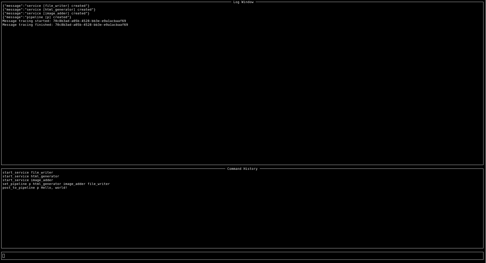
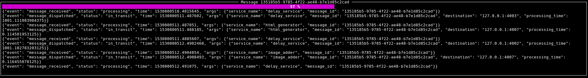

# How does roxcomposer work?

If you don't have installed roxcomposer so far please read the [installation](installation.md) manual.

First of all we need to start up the `roxconnector` the API gateway we will use to control our services. So 
please navigate to the root of the extracted demo package and execute `./start_server.sh`.

After the server has started, we need services. The roxcomposer-demo package contains a couple of services you can use 
located at `cli/services`: 

## Start the roxcomposer-CLI in the terminal:

```bash
cd cli && ./roxcomposer-cli.py
```

## Start the demo services

The cli contains three windows: a log window, a command history and a command line:



Use `start_service` to start our demo services: `html_generator`, `file_writer` and `image_adder`.

```bash
start_service file_writer
```

Afterwards use `services` to get an overview of the running services.
In addition to the ones you just started there will be a service running called `basic_reporting`.
This is an internal service to get monitoring information.

## Define a pipeline

Use the `set_pipeline` command to define a processing pipeline

```bash
set_pipeline p html_generator image_adder file_writer
```

`p` is the name of our pipeline followed by the services it consists of in the order they should process messages.

To check if the pipeline is created correctly, please type `pipelines`.

## Post a message

After setting up your pipeline you can post a message to it:

```
post_to_pipeline p Hello World!
```

The following will happen: `html_generator` will create a simple HTML document from your message and pass it on to 
`image_adder` which will add an image to that document. `file_writer` will commit the document to a file. You should now find a file named `roxcomposer_demo.html` in
the root of the demo folder.

Gratulations you used your first ROXcomposer pipeline!

## Tracking message progress

When you used your first demo pipeline you might have noticed a short flicker inside the cli window. When you initiate a message from within the cli its progress is tracked
automatically in a small window. Since your first pipeline completes very fast the window was gone before you really saw it.

For demonstration purposes we included a delay service with the only purpose to delay messages for one second and then pass them on. We can use it to create a longer running pipeline:

```
set_pipeline p2 delay_service html_generator delay_service image_adder delay_service file_writer delay_service
```

After posting a message to `p2` you should see a new window:



there you will see a progressbar (based on the number of services passed) and detailed log output from the message trace log.

**This concludes our short demo. Have fun!**
